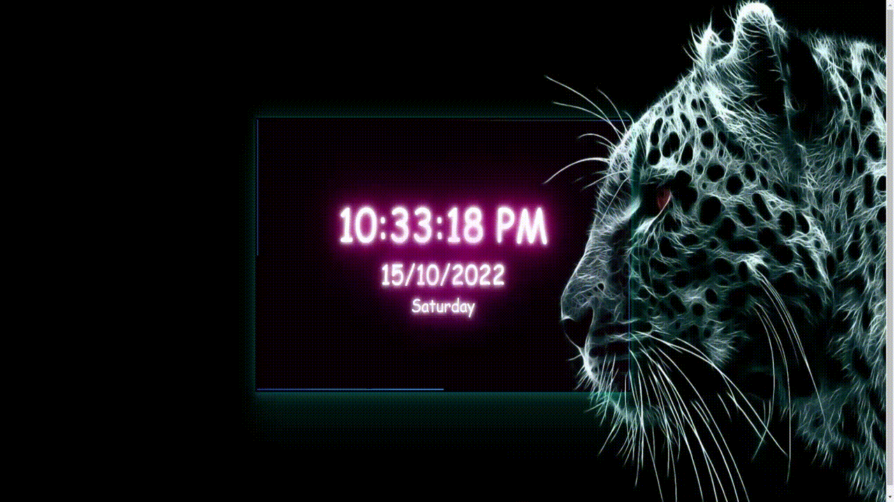

# Digital Clock

## Description

Project aims to create a digital clock.

## Problem Statement

- We are adding a new project to our portfolios. So you and your colleagues have started to work on the project.

## Expected Outcome

## Objective

Build a Digital Clock web site

### At the end of the project, following topics are to be covered;

- HTML

- CSS

- JS

### At the end of the project, students will be able to;

- improve coding skills within HTML & CSS & JS

- use git commands (push, pull, commit, add etc.) and Github as Version Control System.

> > Part-1 HTML Structure

    - Creat structure of the HTML5
    - Give name of your project (title)
    - Create the main structur of the HTML

> > Part-2 CSS Structure

    - Set a background
    - Set container background color and margin
    - Define others color-size-padding etc...

> Part-3 JS Structure

    - Create code for digital clock

## Notes

- These methods can be used for getting information from a date object:

- `getFullYear()` => Get the year as a four digit number (yyyy)

- `getMonth()` => Get the month as a number (0-11)

- `getDate()` => Get the day as a number (1-31)

- `getHours()` => Get the hour (0-23)

- `getMinutes()` => Get the minute (0-59)

- `getSeconds()` => Get the second (0-59)

- `getDay()` => Get the weekday as a number (0-6)

- You can add additional functionalities to your clock.
